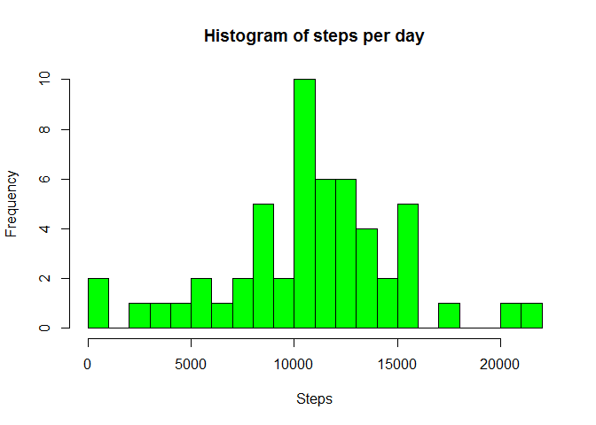
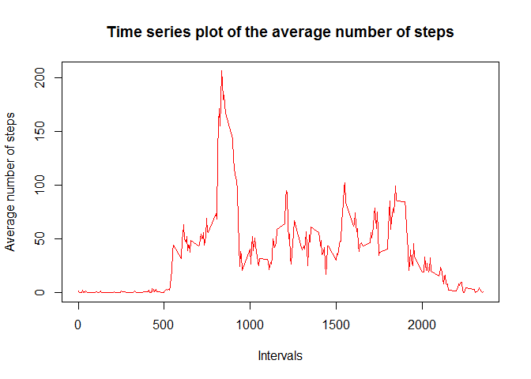
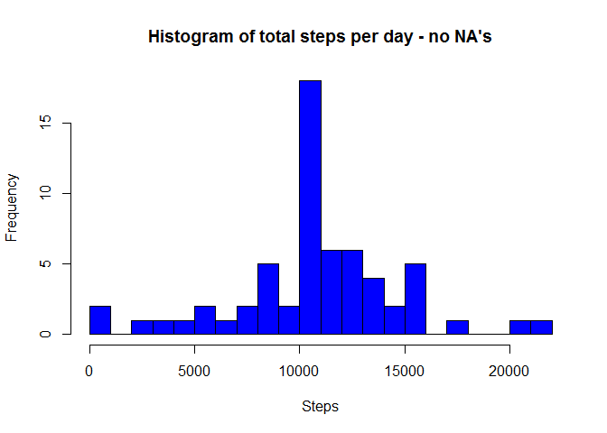
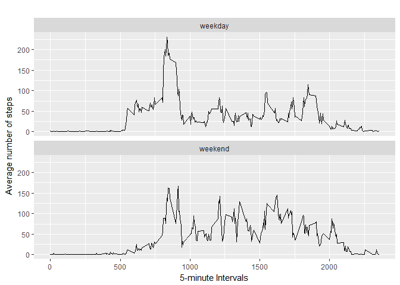

# PA1_template.Rmd
Fernando  
7 de agosto de 2017  


# Reproducible Research
## R Markdown - course project 1

This reproducible research makes use of data from a personal activity monitoring device. This device collects data at 5 minute intervals through out the day. The data consists of two months of data from an anonymous individual collected during the months of October and November, 2012 and include the number of steps taken in 5 minute intervals each day.

The data for this assignment can be downloaded from the course web site:

Dataset: Activity monitoring data [52K]
The variables included in this dataset are:

steps: Number of steps taking in a 5-minute interval (missing values are coded as NA)
date: The date on which the measurement was taken in YYYY-MM-DD format
interval: Identifier for the 5-minute interval in which measurement was taken
The dataset is stored in a comma-separated-value (CSV) file and there are a total of 17,568 observations in this dataset.


## Code for reading in the dataset and/or processing the data

Read activity dataset and show a summary of its data.

```r
setwd("~/R_coursera/Reproducible Research")
activ <- read.csv("activity.csv", header = TRUE)
summary(activ)
```

```
##      steps                date          interval     
##  Min.   :  0.00   2012-10-01:  288   Min.   :   0.0  
##  1st Qu.:  0.00   2012-10-02:  288   1st Qu.: 588.8  
##  Median :  0.00   2012-10-03:  288   Median :1177.5  
##  Mean   : 37.38   2012-10-04:  288   Mean   :1177.5  
##  3rd Qu.: 12.00   2012-10-05:  288   3rd Qu.:1766.2  
##  Max.   :806.00   2012-10-06:  288   Max.   :2355.0  
##  NA's   :2304     (Other)   :15840
```

Processing date and aggregating number of steps per day


```r
activ$date <- as.Date(activ$date, "%Y-%m-%d")
sumsteps <- aggregate(steps ~ date, activ, sum, na.rm=TRUE)
head(sumsteps)
```

```
##         date steps
## 1 2012-10-02   126
## 2 2012-10-03 11352
## 3 2012-10-04 12116
## 4 2012-10-05 13294
## 5 2012-10-06 15420
## 6 2012-10-07 11015
```

## What is mean total number of steps taken per day?
### Histogram of the total number of steps taken each day


```r
hist(sumsteps$steps,col="green", xlab="Steps",main="Histogram of steps per day",breaks = 22)
```

<!-- -->


### Mean and median number of steps taken each day


```r
stepsmean <- mean(sumsteps$steps)
stepsmedian <- median(sumsteps$steps)
```

The mean of total number of steps per day is 1.076619\times 10^{4} and the median is 10765 .

## What is the average daily activity pattern ?


Time series plot of the average number of steps taken


```r
avgstepsinterval <- aggregate(steps ~ interval, activ, mean, na.rm=TRUE)
# Plot the bar chart.
plot(avgstepsinterval,type = "l", col = "red", xlab = "Intervals", ylab = "Average number of steps", main = "Time series plot of the average number of steps")
```

<!-- -->

Calculate the maximum avegrage number of steps

```r
maxstepsint <- max(avgstepsinterval$steps)
```
The 5-minute interval that, on average, contains the maximum number of steps is 206.1698113 .

## Imputing missing values.

Code to describe and show a strategy for inputing missing data:  
The strategy is to input the average number of steps, for the specific interval, into the missing values.

```r
# imputing missing data
totna <- sum(is.na(activ$steps))
newactiv <- activ
for (i in 1:nrow(activ))
{
     if (is.na(activ[i,"steps"])==TRUE)
     {
           interval <- newactiv$interval[i] 
           newactiv$steps[i] <- avgstepsinterval$steps[avgstepsinterval$interval==interval]
     } 
     else  {}
      
}
newtotna <- sum(is.na(newactiv$steps))
```

BEFORE inputing values, the total number of NA's is 2304.  
AFTER inputing values, the total number of NA's is 0.


## Histogram of the total number of steps taken each day after missing values are inputed.

```r
# calculate new total number of steps per day
newsumsteps <- aggregate(steps ~ date, newactiv, sum, na.rm=TRUE)
# plot histogram
hist(newsumsteps$steps,col="blue", xlab="Steps",main="Histogram of total steps per day - no NA's",breaks = 22)
```

<!-- -->

```r
# mean and median
newstepsmean <- mean(newsumsteps$steps)
newstepsmedian <- median(newsumsteps$steps)
```


The mean of new total number of steps per day is 1.076619\times 10^{4} and the median is 1.0766189\times 10^{4} .

## Panel plot comparing the average number of steps taken per 5-minute interval across weekdays and weekends:


```r
library(ggplot2)
# Create factor variable weekday/weekend
Sys.setlocale("LC_ALL","English")
```

```
## [1] "LC_COLLATE=English_United States.1252;LC_CTYPE=English_United States.1252;LC_MONETARY=English_United States.1252;LC_NUMERIC=C;LC_TIME=English_United States.1252"
```

```r
newactiv$day <- weekdays(newactiv$date)
newactiv$day <- as.factor(ifelse(newactiv$day %in% c("Saturday", "Sunday"), "weekend", "weekday"))
# create table to plot graph
stepsintervalday <- aggregate(steps ~ interval+day, newactiv, mean)
```

Graph:


```r
qplot(interval, steps, data=stepsintervalday, geom=c("line"), xlab="5-minute Intervals",ylab="Average number of steps",main="") + facet_wrap( ~ day, ncol=1)
```

<!-- -->

